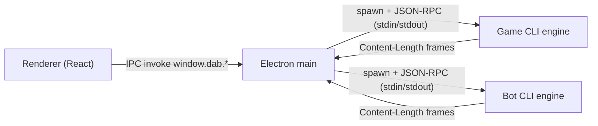

# Архітектура проєкту Dots and Boxes

Цей документ описує проєкт як **єдину систему**: набір CLI-рушіїв (4 мови) + Electron UI, які взаємодіють через спільний JSON-RPC контракт.

## 1) Інвентаризація реалізованого (матриця “функція → код → docs → прогалини”)

| Функціональність | Де реалізовано (код) | Де вже задокументовано | Чого бракує в docs |
|---|---|---|---|
| **Модель даних (Point/Edge/Box/State)** | `src/prolog/yermolovych_dab_core.pl` (терм `state/6`), CLI серіалізація в `src/*/cli*`; типи UI: `ui-electron/renderer/src/model/types.ts` | `docs/tech/protocol.md` (типи), `docs/REPORT.md` (формалізація) | Окремий “user-facing” опис термінів одним файлом (див. `RULES_UA.md`) |
| **Допустимість ходу (legal move)** | Prolog: `valid_edge/4`, `legal_move/3`, `manhattan_one/2` у `src/prolog/yermolovych_dab_core.pl`; UI перевіряє по `possibleMoves` у `ui-electron/renderer/src/hooks/useGameState.ts` | Частково: `docs/tech/protocol.md` (RPC + invalid params), `docs/TESTING.md` (duplicate edge → error) | Чіткі правила допустимого ходу в одному місці (див. `RULES_UA.md`) |
| **Замикання клітинки (closed boxes)** | Prolog: `completed_boxes_by_edge/3`, `adjacent_box_for_edge/4`, `box_closed/2` у `src/prolog/yermolovych_dab_core.pl` | `docs/REPORT.md` (інкрементальна перевірка 0..2 box), `docs/DESIGN_NOTES.md` | Опис “що вважаємо клітинкою” і “як визначається замикання” у правилах (див. `RULES_UA.md`) |
| **Нарахування очок** | Prolog: `add_scores/6` + `apply_move/5`; аналогічно в інших рушіях | `docs/REPORT.md` (state містить s1/s2), `docs/TESTING.md` (сценарії закриття) | Явне формулювання в правилах (див. `RULES_UA.md`) |
| **Extra turn (додатковий хід)** | Prolog: `apply_move/5` встановлює `ExtraTurn`; CLI повертає `extraTurn`; UI використовує для визначення, хто “власник” закритої клітинки | `docs/TESTING.md` (extra turn сценарії) | Явне формулювання в правилах (див. `RULES_UA.md`) |
| **Завершення гри** | Prolog: `game_over/1`; CLI метод `gameOver`; UI прапор `over` у `useGameState.ts` | `docs/tech/protocol.md`, `docs/TESTING.md` | Явне формулювання в правилах (див. `RULES_UA.md`) |
| **Визначення переможця** | UI: банер завершення гри читає `s1/s2` зі state (renderer); рушії лише ведуть рахунок | Непрямо: `docs/REPORT.md` (s1/s2) | Окремий розділ у правилах: переможець/нічия (див. `RULES_UA.md`) |
| **Стратегія бота** | Prolog: `src/prolog/yermolovych_dab_bot.pl` (greedy_close/safe_no_third_side/fallback_min_risk, tie-break); CLI `botMove` повертає `reason`; UI в PvE/PvP керує викликом | `docs/REPORT.md` (політика), `docs/DESIGN_NOTES.md` (узгодженість портів) | Короткий user-facing опис “що робить бот” у правилах + де дивитись reason (див. `RULES_UA.md`) |
| **CLI/JSON-RPC контракт** | Всі CLI: `src/prolog/cli.pl`, `src/python/cli.py`, `src/java/src/main/java/dab/Cli.java`, `src/csharp/DotsAndBoxes.Cli/Program.cs`; transport: Content-Length | `docs/tech/protocol.md` | Розширити опис “UI ↔ CLI” саме для Electron (див. `UI_ELECTRON.md`) |
| **Electron main/preload/renderer** | `ui-electron/electron/main.ts`, `ui-electron/electron/preload.ts`, `ui-electron/renderer/src/*` | `ui-electron/README.md`, `docs/tech/typescript.md` | Окремий документ з API `window.dab`, IPC, логами, recovery (див. `UI_ELECTRON.md`) |
| **Replay (відтворення історії ходів)** | `ui-electron/electron/main.ts` (`dab:replay`), `ui-electron/renderer/src/hooks/useGameState.ts` (`applyReplay`) | Частково: `docs/TESTING.md` (контрактні тести натякають) | Опис replay як механізму undo/redo та resync після restart (див. `UI_ELECTRON.md`) |
| **Undo/Redo** | `ui-electron/renderer/src/hooks/useGameState.ts` (history + redoStack + Ctrl+Z/Ctrl+Y) | Немає окремого опису | Додати в UI-док: як працює (replay), обмеження (див. `UI_ELECTRON.md`) |
| **Save/Load** | IPC + dialog: `ui-electron/electron/main.ts` (`dab:saveGame`, `dab:loadGame`); renderer: `useGameState.ts` | Немає повного опису формату | Додати в UI-док: формат JSON, версія, поля, валідація (див. `UI_ELECTRON.md`) |
| **Engine status / restart / recovery** | `EngineInstance.ts` (status, timeout, Engine stopped), `electron/main.ts` (restartEngines), `useGameState.ts` (recoverEnginesAndReplay) | `ui-electron/README.md` частково (restart згадується побічно), `docs/tech/protocol.md` (коди помилок) | Опис: стани, типові збої (EPIPE, timeout), як відновлюється (див. `UI_ELECTRON.md`) |
| **Логування (req/res/stderr) + LogPanel** | `EngineInstance.ts` (log entries), `electron/main.ts` (sendLog), `renderer/src/components/LogPanel.tsx` | `docs/tech/typescript.md` (згадка), частково `ui-electron/README.md` | Опис структури LogEntry, фільтри/copy/export, verbose режим (див. `UI_ELECTRON.md`) |
| **Тестування** | Движки: `tests/*` (по мовах); UI contract: `ui-electron/scripts/integration-*.test.mjs` + `npm run test:integration*` | `docs/TESTING.md`, `docs/REPORT.md` | Уточнити TESTING: розділити unit/contract/manual; описати prerequisites для UI contract тестів (оновити `docs/TESTING.md`) |

## 2) Компоненти системи

### 2.1. Рушії (CLI)

У проєкті є 4 реалізації рушія гри:

- `src/prolog/` — SWI-Prolog (ядро + бот + CLI-обгортка).
- `src/python/` — Python (пакет логіки + `cli.py`).
- `src/java/` — Java (Gradle, fat JAR).
- `src/csharp/` — C# (.NET, CLI + Core).

Кожен рушій надає **однаковий RPC інтерфейс** (див. `docs/tech/protocol.md`) і тримає поточний state “всередині процесу” після `init`.

### 2.2. UI (Electron)

`ui-electron/` — Electron застосунок:

- `ui-electron/electron/` — main + preload + RPC запуск рушіїв.
- `ui-electron/renderer/` — React UI, керування грою, SVG-дошка, історія ходів, логи.
- `ui-electron/scripts/` — перевірка доступності CLI (`check-cli.cjs`), contract/integration тести.

## 3) Контракт — стабільна межа між UI і рушіями

**Єдина точка узгодження** між різними мовами і UI — це `docs/tech/protocol.md`:

- JSON-RPC 2.0
- фреймування `Content-Length` по stdin/stdout
- методи `init`, `applyMove`, `possibleMoves`, `botMove`, `gameOver`.

Завдяки цьому UI може перемикати рушії без зміни UI-логіки.

## 4) Потік даних (високий рівень)

Деталі API й поведінки статусів/логів — у `docs/UI_ELECTRON.md`.

